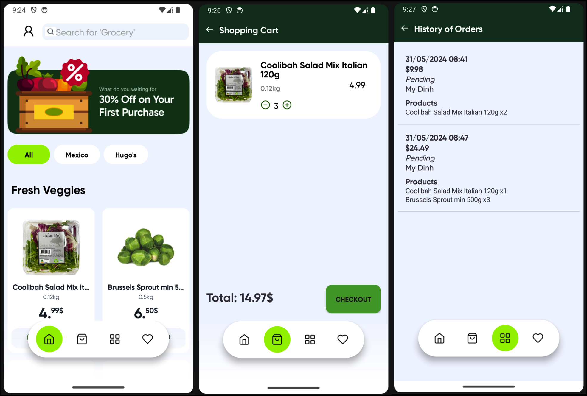
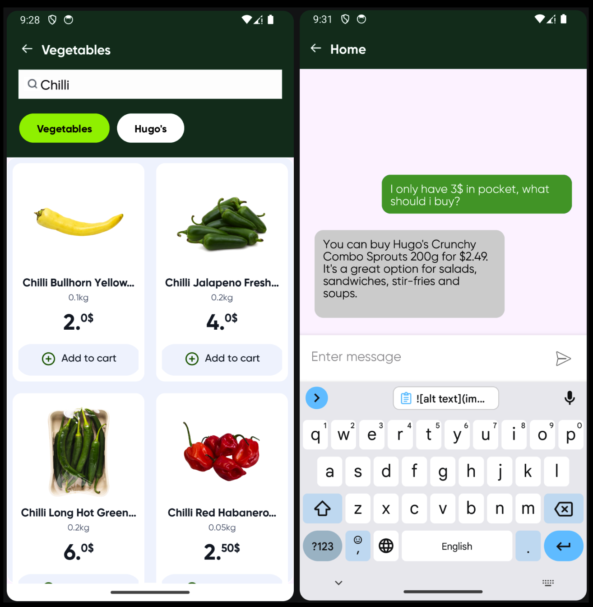
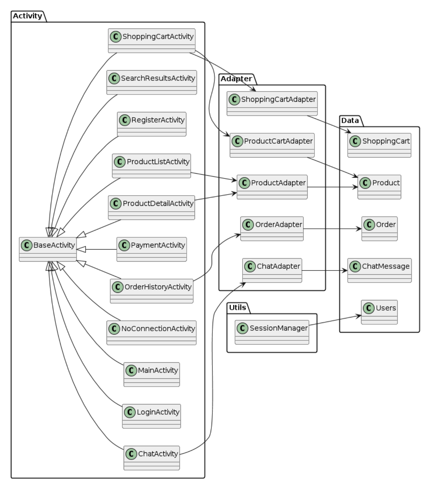

# Ecommerce Vegetable App 🛒🥬

## Description

This is an Android application for an ecommerce platform. It allows users to browse products 🍅🥕, add them to their cart 🛒, make purchases 💰, track orders 📦, and chat with a AI customer service 💬. The app provides a user-friendly interface ✨ and seamless navigation for an optimal shopping experience 👍.

## Table of Contents

* [Features](#features)
* [Screenshots](#screenshots)
* [Installation](#installation)
* [Usage](#usage)
* [Project Structure](#project-structure)
* [Contributing](#contributing)
* [License](#license)

## Features

* **Product Browsing:** Explore a wide range of products categorized for easy navigation 🧭.
* **Product Detail View:** View detailed information about products, including images 📸, descriptions 📝, and reviews ⭐.
* **Shopping Cart:** Add and manage products in your shopping cart 🛒.
* **Order Placement:** Securely place orders and choose from multiple payment options 💳.
* **Order Tracking:** Track the status of your orders in real-time ⏳.
* **Customer Support Chat:** Chat with a customer service representative for assistance using generative AI 🤖.

## Screenshots




## Installation

1. **Clone the repository:**
   ```sh
   git clone https://github.com/minhhoccode/Ecommerce-Vegetable-App.git
   ```
2. **Open the project in Android Studio.**
3. **Sync the project with Gradle files.**
4. **Set up Firebase:** 
    - Create a Firebase project and connect it to your Android app. 
    - Download the `google-services.json` file and place it in your project's `app` directory.
    - Enable email/password authentication in Firebase console.
5. **Create and Populate the Database:**
   - **Install Firebase Admin SDK:** 
     ```bash
     pip install firebase-admin
     ```
   - **Prepare Data:** Replace `"Your Firebase Admin SDK JSON file"` and `"Your Firebase Database URL"`  in `CreateFirebase.py` with your actual credentials and database URL. 
   - **Run Script:** 
     ```bash
     python CreateFirebase.py 
     ```
     This script will:
        * Connect to your Firebase project.
        * Read product data from  `extracted_data.json`.
        * Format and clean the data.
        * Upload each product as a document in the "products" collection in your Firebase database.
6. **Build and run the app on an emulator or physical device** 📱. 

## Usage

1. Launch the app 🚀.
2. Browse or search for products 🔍.
3. Select a product to view its details 👀.
4. Add products to your cart 🛒.
5. Proceed to checkout to place an order ✅.
6. Track your order status 🚚.
7. Use the chat feature for customer support 💬.

## Project Structure



## Contributing

Contributions to this project are welcome 🙌. To contribute:

1. Fork the repository 🍴.
2. Create a new branch for your feature or bug fix 🌿.
3. Make your changes and commit them 🚀.
4. Push your changes to your forked repository 📤.
5. Submit a pull request 🙏.

## License

This project is licensed under the [GPL-3.0 License](LICENSE).
